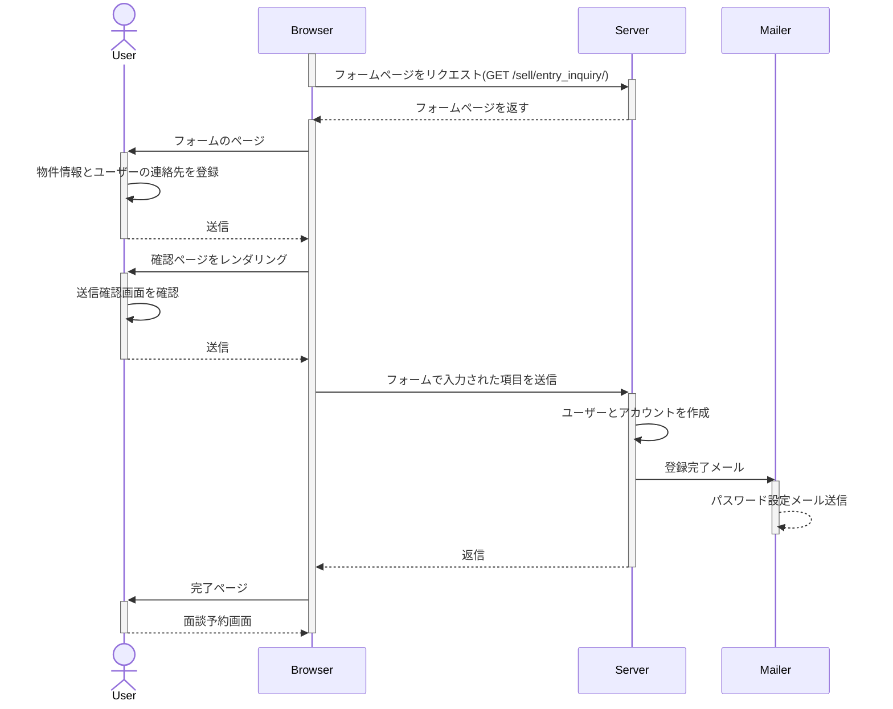
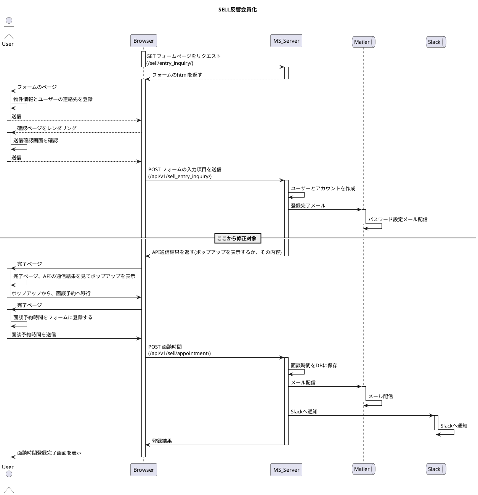

```mermaid
sequenceDiagram
    actor U as User
    participant B as Browser
    participant S as Server
    participant M as Mailer
    activate B
    B->>+S: フォームページをリクエスト(GET /sell/entry_inquiry/)
    deactivate B
    S-->>-B: フォームページを返す
    activate B
    B->>+U: フォームのページ
    U->>U: 物件情報とユーザーの連絡先を登録
    U-->>-B: 送信
    B->>+U: 確認ページをレンダリング
    U->>U: 送信確認画面を確認
    U-->>-B: 送信
    B->>+S: フォームで入力された項目を送信
    S->>S: ユーザーとアカウントを作成
    S->>M: 登録完了メール
    activate M
    M-->>M: パスワード設定メール送信
    deactivate M
    S-->>-B: 返信
    B->>+U: 完了ページ
    U-->>-B: 面談予約画面
    deactivate B
```

```puml
@startuml
title SELL反響会員化

actor User
participant Browser
participant MS_Server
queue Mailer
queue Slack

activate Browser
Browser -> MS_Server: GET フォームページをリクエスト\n(/sell/entry_inquiry/)
deactivate Browser
activate MS_Server
Browser <-- MS_Server: フォームのhtmlを返す
deactivate MS_Server

activate Browser
User <-- Browser: フォームのページ
activate User
User -> User: 物件情報とユーザーの連絡先を登録
User --> Browser: 送信
deactivate User

User <-- Browser: 確認ページをレンダリング
activate User
User -> User: 送信確認画面を確認
User --> Browser: 送信
deactivate User

Browser -> MS_Server: POST フォームの入力項目を送信\n(/api/v1/sell_entry_inquiry/)
activate MS_Server

MS_Server -> MS_Server: ユーザーとアカウントを作成
MS_Server -> Mailer: 登録完了メール
activate Mailer
Mailer -> Mailer: パスワード設定メール配信
deactivate Mailer
== ここから修正対象 ==
MS_Server -> Browser: API通信結果を返す(ポップアップを表示するか、その内容)
deactivate MS_Server

User <- Browser: 完了ページ
activate User
User -> User: 完了ページ、APIの通信結果を見てポップアップを表示
User -> Browser: ポップアップから、面談予約へ移行
deactivate User

User <- Browser: 完了ページ
activate User
User -> User: 面談予約時間をフォームに登録する
User -> Browser: 面談予約時間を送信
deactivate User

Browser -> MS_Server: POST 面談時間\n(/api/v1/sell/appointment/)
activate MS_Server
MS_Server -> MS_Server: 面談時間をDBに保存
MS_Server -> Mailer: メール配信
activate Mailer
Mailer -> Mailer: メール配信
deactivate Mailer
MS_Server -> Slack: Slackへ通知
activate Slack
Slack -> Slack: Slackへ通知
deactivate Slack
Browser <- MS_Server: 登録結果
deactivate MS_Server

User <- Browser: 面談時間登録完了画面を表示
deactivate Browser
activate User
deactivate User
@enduml
```
