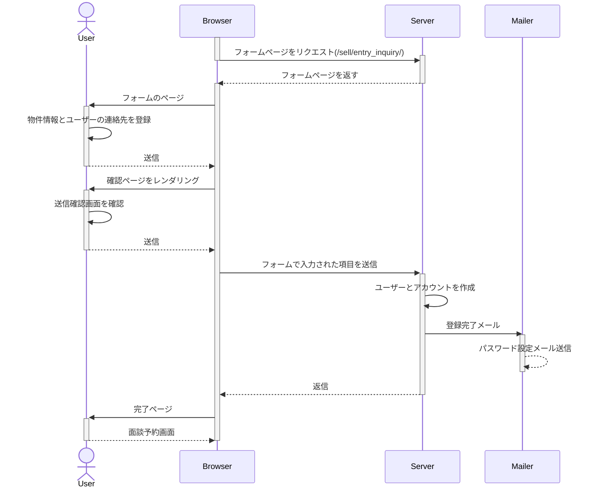

```mermaid
sequenceDiagram
    actor U as User
    participant B as Browser
    participant S as Server
    participant M as Mailer
    activate B
    B->>+S: フォームページをリクエスト(/sell/entry_inquiry/)
    deactivate B
    S-->>-B: フォームページを返す
    activate B
    B->>+U: フォームのページ
    U->>U: 物件情報とユーザーの連絡先を登録
    U-->>-B: 送信
    B->>+U: 確認ページをレンダリング
    U->>U: 送信確認画面を確認
    U-->>-B: 送信
    B->>+S: フォームで入力された項目を送信
    S->>S: ユーザーとアカウントを作成
    S->>M: 登録完了メール
    activate M
    M-->>M: パスワード設定メール送信
    deactivate M
    S-->>-B: 返信
    B->>+U: 完了ページ
    U-->>-B: 面談予約画面
    deactivate B
```